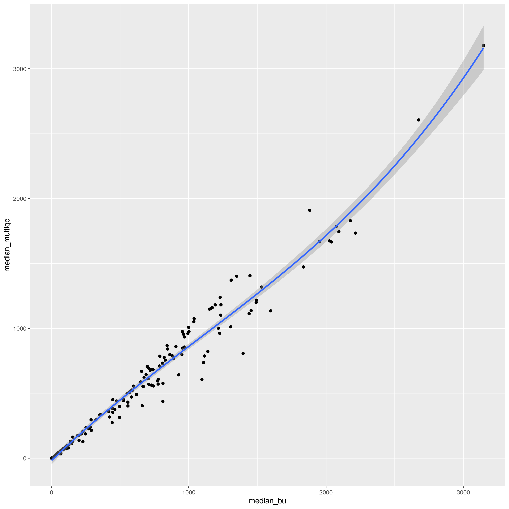

# Análisis diferencias de la mediana y e %10x entre los valores del summary_mqc y los calculos de BU

Analizamos las diferencias entre el cálculo de la mediana de la cobertura y el % del genoma con cobertura > 10x. El análisis esta recogido en el script _01_analysis.R. Comaparamos los valores originales de la mediana y del %10x de summary_mqc de multiqc con los resultados obtenidos del análisis de la cobertura de mosdepth. Son un total de 161 muestras que tenemos valores de ambas formas.

## Análisis

He realizado los siguientes análisis estadísticos:
- Test de Wilconxon (Mann-Whitney) para comparar los valores de la mediana y el %10x del multiqc y el calculado por mi
- Spearman correlation: Medida no paramétrica de la correlación de rango (dependencia estadística del ranking entre dos variables). Mide la fuerza y la dirección de la asociación entre dos variables.
- Smooth plot: Ajuste entre las dos variables por medio de una regresión lineal

## Resultados

> Mediana

- El test de Wilconxon obtiene un **p-valor mayor a 0.05 (0.18)**, por lo que aceptamos la hipotesis nula de igualdad de medianas.
- El coeficiente de correlación de Spearman obtiene **un valor de 0.987**, indicando una gran dependencia entre las dos variables

> %10x

- El test de Wilconxon obtiene un **p-valor mayor a 0.05 (0.34)**, por lo que aceptamos la hipotesis nula de igualdad de medianas.
- El coeficiente de correlación de Spearman obtiene **un valor de 0.98**, indicando una gran dependencia entre las dos variables

